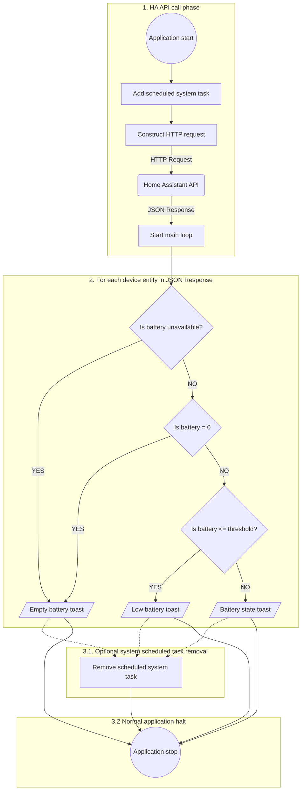

# Home Assistant Batteries Monitor

## Brief description

This is a very simple application designed to monitor and provide in systems
toast messages the detailed information about battery states of your chosen
Home Assistant entities.


## OS and programming language

This application is written in Python exclusively for Windows 11.
Nevertheless it uses on the code level invoking of some CMD commands.

## Source code structure

You can find this application's source code in ***src*** folder. It contains 2 files:

- ***batteries.py*** - the main launchable script
- ***winprocess.py*** - separated code file, contains definitions of functions using CMD
commands to add the app as a scheduled task (so it will be relaunched every 1 hour) and a special
function removing the freshly added scheduled task. 

## Application logic schema


### Notes on system scheduled system task

Phase ***3.1*** is completely optional. Is is intended to be used only for testing purposes.
To enable this phase uncomment this
```commandline
# winprocess.remove_autostart()
```
line in ***batteries.py*** script.

## Required Python modules

- requests
- windows_toasts
- urllib3
- sys
- subprocess
- os

## How to customize the app for your needs

To customize the application to your specific situation please edit ***batteries.py*** script. 

### HA long lasting token

```commandline
# HA authorization token

token = "YOUR TOKEN HERE"
```
Just put your token string instead of YOUR TOKEN HERE

#### Example

```commandline
# HA authorization token

token = "123abc456def789ghi"
```
Tip: A real token will be a very long string

### HA URL

```commandline
# HA instance ip as string

haUrl = "YOUR URL HERE"
```

Just put your HA URL instead of YOUR URL HERE

#### Examples

```commandline
# HA instance ip as string

haUrl = "http://192.168.1.234:8123"
```
For ordinary http access.

```commandline
# HA instance ip as string

haUrl = "https://192.168.1.234:8123"
```
For https access

### Observed devices list as a dictionary

```commandline
# batteries dictionary definition

batteries = {
    "Device 1 name": "battery sensor entity id for device 1",
    "Device 2 name": "battery sensor entity id for device 2",
    "Device 3 name": "battery sensor entity id for device 3",
    # you can put as many devices you want to this dictionary
    "Device n name": "battery sensor entity id for device n"
}
```
Just construct your own dictionary, only the entity ids' need to be taken from HA.
Device name can be anything you like. Look at the example bellow.

#### Example

```commandline
# batteries dictionary definition

batteries = {
    "Termometr w sypialni": "sensor.termometr_duzy_sypialnia_bateria",
    "Termometr w salonie": "sensor.termometr_duzy_salon_bateria",
    "Termometr od podwórka": "sensor.termometr_podworko_bateria",
    "Termometr od drogi": "sensor.termometr_droga_bateria"

}
```

## Notice on assumed OS language

This application is designed exclusively to parse powershell commands (from winprocess.py)
with polish coding - you may need to adjust ***setup_autostart*** ***remove_autostart***
to your specific locale needs.

## Packaging the application as a standalone Windows executable (.exe)

You can build a standalone `.exe` file that runs natively on Windows
without requiring a Python installation.

### Prerequisites

Install ***pyinstaller*** inside your virtual environment:

```shell
python -m pip install pyinstaller
```

### Build command

After installing pyinstaller please run the following command from the directory with the source
python scripts:

```shell
pyinstaller --noconsole --onefile --name "HA Battery Monitor" .\batteries.py
```
You will find a freshly created ***dist*** folder with ***HA Battery Monitor.exe*** file.
The freshly created exe application can freely moved to a place of your desire. Then launch it once
and (as long as you do not change it's location) it will be automatically relaunched by Windows.

### Options explanation

- `--onefile`: Bundles the entire application and its dependencies into a single, standalone .exe file.
- `--noconsole`: Hides the black CMD terminal window, allowing the script to run seamlessly in the background 
and display native Windows Toasts.
- `--name`: Sets the output executable name.

## Notice on Python virtual environments

This project assumes you are familiar with Python virtual environments (`venv`)
and best practices regarding dependency isolation. If you are new to virtual environments
or need a refresher on how to set them up, check out the
official [Python Virtual Environments Tutorial](https://docs.python.org/3/tutorial/venv.html)
or this beginner-friendly guide
on [Real Python](https://realpython.com/python-virtual-environments-a-primer/).
