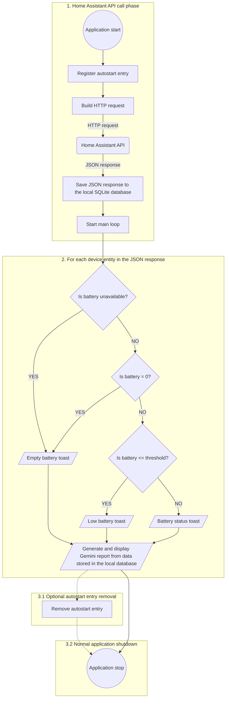

# Home Assistant Battery Monitor

## Overview

This is a Windows application that monitors the battery levels of your chosen
Home Assistant entities and displays the information as native Windows toast
notifications. In addition, the application generates a detailed battery
health report powered by an LLM (Google Gemini), based on the historical data
collected over time.

Usage is straightforward: launch the app, fill in the required information in
the first-run configuration window, and you're done. The application
registers itself to launch automatically at every login and will keep
delivering battery status toasts along with a nicely styled AI-generated
report, shown in a popup webview window.

## Screenshots

All screenshots are taken with the current Polish version of the ui.

### Configuration window - first run wizard

[](/ToMiDevelop/HABatteryCheckerForWindows/blob/main/pics/config.png)

### Popup report window

[](/ToMiDevelop/HABatteryCheckerForWindows/blob/main/pics/report1.png)

### Popup report window

[](/ToMiDevelop/HABatteryCheckerForWindows/blob/main/pics/report2.png)

# System toasts

[](/ToMiDevelop/HABatteryCheckerForWindows/blob/main/pics/toasts.png)

## Operating system and programming language

This application is written in Python and is intended exclusively for
Windows 11. At the code level, it relies on invoking certain Windows shell
commands.

## Source code structure

The application's source code is located in the **`src`** folder and consists
of the following files:

- **`main.py`** – the main entry point of the application
- **`configwindow.py`** – handles the first-run configuration window
- **`winprocess.py`** – manages adding the application to Windows autostart
  (and removing it, for testing purposes)
- **`database.py`** – manages the connection to the local SQLite database and
  basic database operations
- **`devices.py`** – to be edited by the user before building the Windows
  executable; defines device names and their corresponding Home Assistant
  entity IDs
- **`firstrun.py`** – handles the application's first-run logic
- **`normalrun.py`** – handles regular (non-first) run logic
- **`homeassistant.py`** – handles data retrieval from the Home Assistant API
- **`messages.py`** – holds UI and prompt strings; currently available in
  Polish only
- **`mytoastspl.py`** – manages custom Windows toast notifications
- **`ai.py`** – handles communication with the Gemini API
- **`reporter.py`** – converts the Gemini response into a styled HTML report
- **`reportsgui.py`** – displays the generated report in a webview window

The **`pics`** folder contains the application author's avatar image, used in
the initial configuration window.

## Application logic overview



### Notes on the autostart mechanism

The application registers itself for autostart through the Windows Task
Scheduler, using the `pywin32` COM API (`Schedule.Service`). A task is
created to run the executable at user logon, using the current user's
context — no administrator privileges are required.

This registration step runs on every application launch and always updates
the task's target path to the executable's current location. This means
that if you move the `.exe` file to a different folder, the scheduled task
is automatically corrected the next time you run the application manually —
there is no stale, broken autostart entry to clean up.

Removing the scheduled task is optional and intended for testing purposes
only. To enable automatic removal on application exit, uncomment the
following line in `main.py`:

```python
# winprocess.remove_autostart()
```

## Required Python packages

All required packages are pinned in the [`requirements.txt`](requirements.txt)
file in the root of this repository. Install them all at once, inside your
virtual environment, with:

```
pip install -r requirements.txt
```

The table below lists the same packages individually, together with the
module names used to import them in the source code — useful if you only
need to install a subset of them, or if you're troubleshooting a missing
dependency (module names used in `import` statements are not always
identical to their PyPI package names).

| Import name(s)                     | Install with `pip install ...`   | Notes                                   |
|-------------------------------------|-----------------------------------|------------------------------------------|
| `requests`                          | `requests`                        |                                          |
| `windows_toasts`                    | `windows-toasts`                  |                                          |
| `urllib3`                           | `urllib3`                         | Typically installed as a dependency of `requests` |
| `sqlalchemy`                        | `SQLAlchemy`                      |                                          |
| `google`, `google.genai`            | `google-genai`                    |                                          |
| `customtkinter`                     | `customtkinter`                   |                                          |
| `PIL` (used in `configwindow.py`)   | `Pillow`                          |                                          |
| `dotenv`                            | `python-dotenv`                   |                                          |
| `markdown`                          | `Markdown`                        |                                          |
| `webview`                           | `pywebview`                       |                                          |
| `win32com`                          | `pywin32`                         | Used for Task Scheduler autostart registration |

The following modules are part of the Python standard library and do **not**
require a separate `pip install`:

`sys`, `subprocess`, `os`, `json`, `dataclasses`, `pathlib`, `datetime`,
`typing`.

## Customizing the application for your setup

To adapt the application to your own Home Assistant instance, edit the
`devices.py` script.

### Observed devices

#### Battery percentage

```python
devicesBatteryValueList = {
    "Device 1 name": "battery sensor entity id for device 1",
    "Device 2 name": "battery sensor entity id for device 2",
    "Device 3 name": "battery sensor entity id for device 3",
    # add as many devices as you need
    "Device n name": "battery sensor entity id for device n"
}
```

Build your own dictionary — only the entity IDs need to be taken from Home
Assistant. Device names can be anything you like. See the example below.

#### Battery percentage – example

```python
devicesBatteryValueList = {
    "Bedroom thermometer": "sensor.bedroom_thermometer_battery",
    "Living room thermometer": "sensor.living_room_thermometer_battery",
    "Backyard thermometer": "sensor.backyard_thermometer_battery",
    "Roadside thermometer": "sensor.roadside_thermometer_battery"
}
```

#### Battery type

```python
devicesBatteryTypeList = {
    "Device 1 name": "battery type sensor entity id for device 1",
    "Device 2 name": "battery type sensor entity id for device 2",
    "Device 3 name": "battery type sensor entity id for device 3",
    # add as many devices as you need
    "Device n name": "battery type sensor entity id for device n"
}
```

#### Battery type – example

```python
devicesBatteryTypeList = {
    "Bedroom thermometer": "sensor.bedroom_thermometer_battery_type",
    "Living room thermometer": "sensor.living_room_thermometer_battery_type",
    "Backyard thermometer": "sensor.backyard_thermometer_battery_type",
    "Roadside thermometer": "sensor.roadside_thermometer_battery_type"
}
```

#### Device LQI values

```python
devicesLQIList = {
    "Device 1 name": "LQI sensor entity id for device 1",
    "Device 2 name": "LQI sensor entity id for device 2",
    "Device 3 name": "LQI sensor entity id for device 3",
    # add as many devices as you need
    "Device n name": "LQI sensor entity id for device n"
}
```

#### Device LQI values – example

```python
devicesLQIList = {
    "Bedroom thermometer": "sensor.sonoff_snzb_02d_lqi_2",
    "Living room thermometer": "sensor.sonoff_snzb_02d_lqi",
    "Backyard thermometer": "sensor.backyard_thermometer_lqi",
    "Roadside thermometer": "sensor.roadside_thermometer_lqi"
}
```

#### Device RSSI values

```python
devicesRSSIList = {
    "Device 1 name": "RSSI sensor entity id for device 1",
    "Device 2 name": "RSSI sensor entity id for device 2",
    "Device 3 name": "RSSI sensor entity id for device 3",
    # add as many devices as you need
    "Device n name": "RSSI sensor entity id for device n"
}
```

#### Device RSSI values – example

```python
devicesRSSIList = {
    "Bedroom thermometer": "sensor.sonoff_snzb_02d_rssi_2",
    "Living room thermometer": "sensor.sonoff_snzb_02d_rssi",
    "Backyard thermometer": "sensor.backyard_thermometer_rssi",
    "Roadside thermometer": "sensor.roadside_thermometer_rssi"
}
```

#### Battery threshold

```python
batteryThreshold = IntegerNumber
```

The battery threshold defines the cutoff percentage below which a battery
level is treated as critically low.

#### Battery threshold – example

```python
batteryThreshold = 10
```

## Security considerations

This application makes two deliberate security trade-offs, aimed at a
single-user, home-lab environment. Please review them before using the app
in any other context:

- **Unencrypted credentials file.** The Home Assistant long-lived access
  token and the Gemini API key are stored in plain text in
  `data/secrets.env`. This file is not encrypted at rest. Anyone with file
  system access to the machine (or to a backup of it) can read these
  credentials. Do not use this application on a shared or multi-user
  computer, and make sure the machine itself is adequately secured (disk
  encryption, user account access controls, etc.).
- **Disabled SSL certificate verification.** All requests to the Home
  Assistant REST API are made with certificate verification turned off
  (`verify=False`). This is intentional, since Home Assistant instances in
  home-lab setups commonly use self-signed certificates. However, it also
  means the application will not detect a man-in-the-middle attack on the
  connection to your Home Assistant instance. Only use this application over
  a trusted local network, and avoid exposing your Home Assistant instance
  to the public internet without a properly signed certificate and a
  reverse proxy.

## Building a standalone Windows executable (.exe)

You can build a standalone `.exe` file that runs natively on Windows without
requiring a separate Python installation.

### Prerequisites

`pyinstaller` is already included in `requirements.txt`, so if you've
followed the installation step above, it is already available in your
virtual environment. Otherwise, install it separately with:

```
python -m pip install pyinstaller
```

### Build command

Run the following command from the directory containing the Python source
files:

```
pyinstaller --noconsole --onefile --name "HA Battery Monitor" src/main.py
```

Once the build completes, you will find the resulting
`HA Battery Monitor.exe` file inside the newly created `dist` folder. The
executable can be freely moved to a location of your choice. Launch it once,
and — as long as you do not move it afterwards — Windows will relaunch it
automatically on every subsequent login.

### Build options explained

- `--onefile` – bundles the entire application and its dependencies into a
  single, standalone `.exe` file.
- `--noconsole` – hides the console window, allowing the application to run
  in the background and display native Windows toast notifications only.
- `--name` – sets the name of the output executable.

## Notice on Python virtual environments

This project assumes familiarity with Python virtual environments (`venv`)
and best practices around dependency isolation. If you are new to virtual
environments, check out the official
[Python Virtual Environments tutorial](https://docs.python.org/3/tutorial/venv.html)
or this beginner-friendly guide on
[Real Python](https://realpython.com/python-virtual-environments-a-primer/).

## License

Distributed under the GPL-3.0 License. See `LICENSE` for details.
