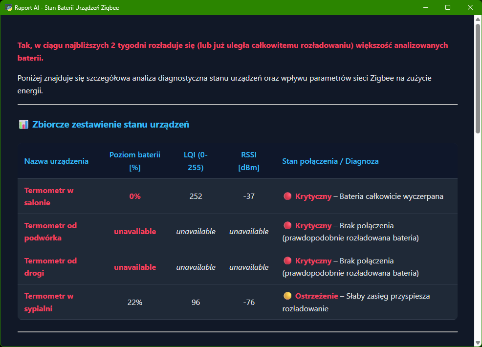
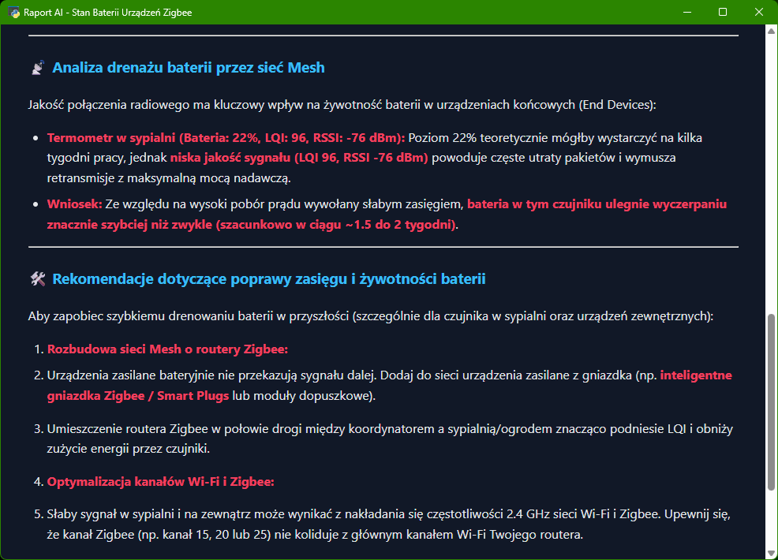
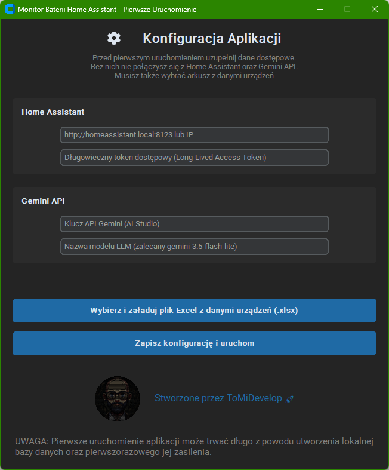
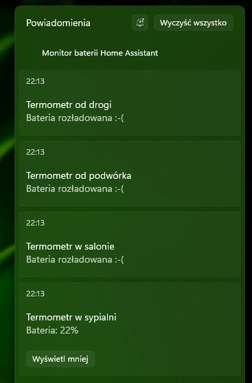
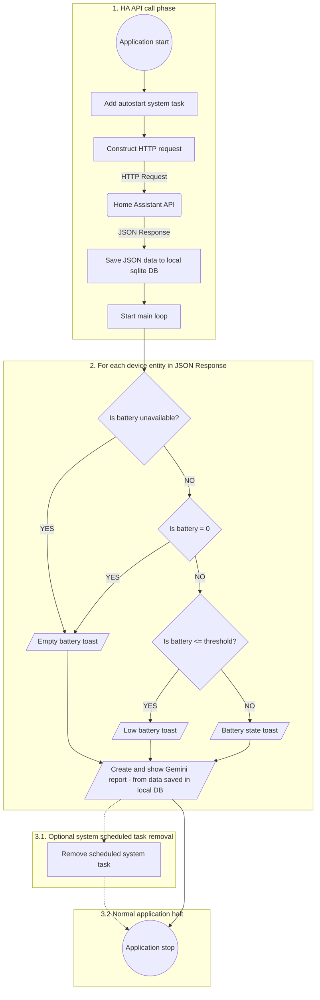

# Home Assistant Batteries Monitor

## Brief description

This an application designed to monitor and provide in systems
toast messages the detailed information about battery states of your chosen
Home Assistant entities. Moreover the application provides detailed reports about battery life
provided by a LLM - Gemini from Google. The operation is very straightforward. Just launch the app - fill in the info
required in the first run config window and there you go. The App will launch itself from autostart at every login
and provide simplified battery info toasts with a detailed AI report showing as a nicely styled html (in a popping up
simple webview window).

## Screenshots









## OS and programming language

This application is written in Python exclusively for Windows 11.
It uses on the code level invoking of some CMD commands.

## Source code structure

You can find this application's source code in ***src*** folder. It contains a series of files:

- ***main.py*** - the main launchable script
- ***configwindow.py*** - handles the config window
- ***winprocess.py*** - handles adding app to windows scheduler (also removing the app if needed tor tests)
- ***database.py*** - handles connection with local sqlite db file and basic db operations
- ***devices.py*** - to be filled in by the user before producing a Windows executable - handles device names and
unique entity ids'.
- ***firstrun.py*** - handles app first run actions
- ***normalrun.py*** - handles ordinary (not first) run operations
- ***homeassistant.py*** - handles retrieving data from HA API
- ***messages.py*** - holds message strings to be displayed in GUI - currently only in polish
- ***mytoasts.py*** - operates custom Windows toast messages
- ***reporter.py*** - handles extracting data from Gemini responses
- ***reportsgui.py*** - handles showing Gemini reports data in a nice webview window as a styled html page

## Application logic schema


### Notes on scheduled system task

Phase ***3.1*** is completely optional. Is is intended to be used only for testing purposes.
To enable this phase uncomment this
```commandline
# winprocess.remove_autostart()
```
line in ***main.py*** script.

## Required Python modules imports

- requests
- windows_toasts
- urllib3
- sys
- subprocess
- os
- json
- sqlalchemy
- google
- google.genai
- dataclasses
- pathlib
- customtkinter
- dotenv
- datetime
- typing
- markdown
- webview

## How to customize the app for your needs

To customize the application to your specific situation please edit ***devices.py*** and ***main.py*** script. 

### Observed devices

To provide the information about observed devices modify ***devices.py*** file as shown bellow. 

#### Batteries percent

```commandline
devicesBatteryValueList = {
    "Device 1 name": "battery sensor entity id for device 1",
    "Device 2 name": "battery sensor entity id for device 2",
    "Device 3 name": "battery sensor entity id for device 3",
    # you can put as many devices you want to this dictionary
    "Device n name": "battery sensor entity id for device n"
}
```
Just construct your own dictionary, only the entity ids' need to be taken from HA.
Device name can be anything you like. Look at the example bellow.

#### Batteries percent example

```commandline
devicesBatteryValueList = {
    "Termometr w sypialni": "sensor.termometr_duzy_sypialnia_bateria",
    "Termometr w salonie": "sensor.termometr_duzy_salon_bateria",
    "Termometr od podwórka": "sensor.termometr_podworko_bateria",
    "Termometr od drogi": "sensor.termometr_droga_bateria"
}
```

#### Batteries types

```commandline
devicesBatteryTypeList = {
    "Device 1 name": "battery sensor entity id for device 1",
    "Device 2 name": "battery sensor entity id for device 2",
    "Device 3 name": "battery sensor entity id for device 3",
    # you can put as many devices you want to this dictionary
    "Device n name": "battery sensor entity id for device n"
}
```

#### Batteries types example

```commandline
devicesBatteryTypeList = {
    "Termometr w sypialni": "sensor.termometr_duzy_sypialnia_battery_type",
    "Termometr w salonie": "sensor.termometr_duzy_salon_battery_type",
    "Termometr od podwórka": "sensor.termometr_podworko_battery_type",
    "Termometr od drogi": "sensor.termometr_droga_battery_type"
}
```

#### Devices LQI values

```commandline
devicesLQIList = {
    "Device 1 name": "battery sensor entity id for device 1",
    "Device 2 name": "battery sensor entity id for device 2",
    "Device 3 name": "battery sensor entity id for device 3",
    # you can put as many devices you want to this dictionary
    "Device n name": "battery sensor entity id for device n"
}
```

#### Devices LQI values example

```commandline
devicesLQIList = {
    "Termometr w sypialni": "sensor.sonoff_snzb_02d_lqi_2",
    "Termometr w salonie": "sensor.sonoff_snzb_02d_lqi",
    "Termometr od podwórka": "sensor.termometr_podworko_lqi",
    "Termometr od drogi": "sensor.termometr_droga_lqi"
}
```

#### Devices LSSI values

```commandline
devicesLSSIList = {
    "Device 1 name": "battery sensor entity id for device 1",
    "Device 2 name": "battery sensor entity id for device 2",
    "Device 3 name": "battery sensor entity id for device 3",
    # you can put as many devices you want to this dictionary
    "Device n name": "battery sensor entity id for device n"
}
```

#### Devices LSSI values example

```commandline
devicesRSSIList = {
    "Termometr w sypialni": "sensor.sonoff_snzb_02d_rssi_2",
    "Termometr w salonie": "sensor.sonoff_snzb_02d_rssi",
    "Termometr od podwórka": "sensor.termometr_podworko_rssi",
    "Termometr od drogi": "sensor.termometr_droga_rssi"
}
```

#### Battery threshold

```commandline
batteryThreshold = IntegerNumber
```
Battery threshold is used to cut battery percent values - if value lower than threshold then understood as very low.


#### Battery threshold example

```commandline
batteryThreshold = 10
```

## Notice on assumed OS language

This application is designed exclusively to parse cmd commands (in ***winprocess.py***)
with polish coding - you may need to adjust ***setup_autostart*** ***remove_autostart***
to your specific locale needs.

## Packaging the application as a standalone Windows executable (.exe)

You can build a standalone `.exe` file that runs natively on Windows
without requiring a Python installation.

### Prerequisites

Install ***pyinstaller*** inside your virtual environment:

```shell
python -m pip install pyinstaller
```

### Build command

After installing pyinstaller please run the following command from the directory with the source
python scripts:

```shell
pyinstaller --noconsole --onefile --name "HA Battery Monitor" .\batteries.py
```
You will find a freshly created ***dist*** folder with ***HA Battery Monitor.exe*** file.
The freshly created exe application can freely moved to a place of your desire. Then launch it once
and (as long as you do not change it's location) it will be automatically relaunched by Windows.

### Options explanation

- `--onefile`: Bundles the entire application and its dependencies into a single, standalone .exe file.
- `--noconsole`: Hides the black CMD terminal window, allowing the script to run seamlessly in the background 
and display native Windows Toasts.
- `--name`: Sets the output executable name.

## Notice on Python virtual environments

This project assumes you are familiar with Python virtual environments (`venv`)
and best practices regarding dependency isolation. If you are new to virtual environments
or need a refresher on how to set them up, check out the
official [Python Virtual Environments Tutorial](https://docs.python.org/3/tutorial/venv.html)
or this beginner-friendly guide
on [Real Python](https://realpython.com/python-virtual-environments-a-primer/).
